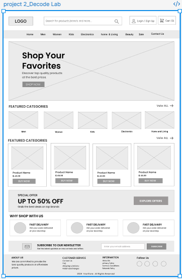

# Project 2 - E-Commerce Website Wireframe

This project was created as part of my DecodeLabs UI/UX Internship.

## Project Overview

The objective of this project was to design a low-fidelity wireframe for an e-commerce website. The design includes the homepage, product categories, featured products, special offers, and footer sections while following basic UI/UX principles.

## Preview

## PDF

[View Project PDF](./decode%20lab%20-%20Project%202.pdf)

## Figma Design

https://www.figma.com/design/FyImAuDrSa31zeh5zGUTue/project-2_DECODE-LAB?node-id=2-6&t=wISgBS5TWrwDTHit-1

## Tools Used

- Figma
- Wireframing
- UI/UX Design

## Created By

**Gittiqa Maheshwari**
